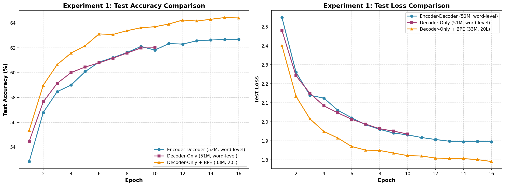
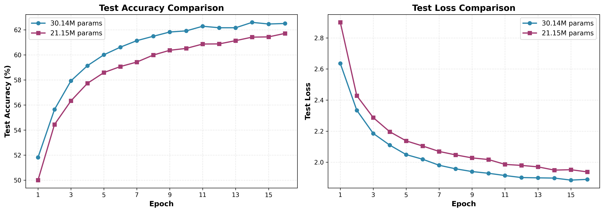

# Alpha Transformer

A **from-scratch Transformer implementation trained for English → French translation**.

This project was built to understand how Transformers work internally by implementing the architecture, attention mechanisms, training pipeline, and inference system directly in PyTorch.

The main model is an Encoder-Decoder Transformer trained from scratch on the OPUS-100 English-French dataset. The original project uses a 51M parameter model with custom attention, RoPE positional embeddings, and no pretrained weights.

---

## Translation Examples

| English Input | Model Output |
|---|---|
| "hi" | bonjour |
| "how are you doing on this fine day?" | comment allez-vous ce beau jour? |
| "I am taking a shower while listening to music" | je prends une douche en écoutant la musique |
| "This is indeed a fine day" | c'est effectivement un bon jour |

---

# Architecture

The main Alpha model uses an Encoder-Decoder Transformer architecture with cross-attention.

| Component | Configuration |
|-|-|
| Embedding Dimension | 256 |
| Attention Heads | 8 |
| Feed Forward Dimension | 1024 |
| Encoder Layers | 3 |
| Decoder Layers | 3 |
| Parameters | ~51M |
| Positional Encoding | RoPE |

The encoder processes the source sentence and creates a representation of its meaning. The decoder then generates the translation while using cross-attention to access the encoder representation.

---

# Architectural Experiments

To better understand what makes a Transformer effective for translation, several models were trained from scratch and compared.

The goal was not only to maximize accuracy, but to understand how architectural choices affect translation quality.

---

# Experiment 1: Encoder-Decoder vs Decoder-Only

Three models were compared:

| Model | Architecture | Parameters | Tokenizer |
|-|-|-|-|
| R1 — Encoder-Decoder | 3 encoder layers + 3 decoder layers with cross-attention | 52M | Word-level |
| R2 — Decoder-Only | 20 decoder layers | 51M | Word-level |
| R3 — Decoder-Only + BPE | 20 decoder layers | 33M | BPE |

## Quantitative Results

By raw test accuracy, R3 (Decoder-Only + BPE) comes out ahead, reaching approximately **64.44%** — clearly above R1's 62.69% and R2's 62.00%.

## Qualitative Results (Inference)

| Input | R1 (Encoder-Decoder) | R2 (Decoder-Only, 20L, Word-level) | R3 (Decoder-Only, 20L, BPE) |
|---|---|---|---|
| "hi" | "bonjour" | "- J'adore." | "-" |
| "How are you doing on this fine day?" | "comment allez-vous ce beau jour?" | "Ça va, je vais me faire un peu de ça." | "Comment allez-vous sur ce bon moment?" |
| "I am taking a shower while listening to music" | "je prends une douche en écoutant la musique" | "Je prends une douche avec la musique, je prends un bain pendant que j'écoute la musique." | "Je prends une douche pendant que je m'appuie sur la musique." |
| "This is indeed a fine day" | "c'est effectivement un bon jour" | "C'est vrai, c'est vrai, c'est un jour merveilleux." | "C'est un beau jour." |
| "I would definitely go if I could, but you know how busy I am these days" | "je m'en certainement si je pouvais, mais vous savez combien je suis occupé ces jours" | "Je pourrais bien y aller, je pourrais bien y aller." | "Je ne serais pas là si je pouvais, mais vous savez combien je suis occupé" |

## Conclusion

Despite scoring lowest on raw test accuracy, **R1 (Encoder-Decoder) clearly produces the most reliable and coherent translations** across every example. It is the only model that avoids repetition loops ("je pourrais bien y aller, je pourrais bien y aller") and outright collapse on short inputs ("hi" → "-").

This is a genuinely counterintuitive result given the graph: R3 has both more depth (20 layers vs. R1's 6 total) and a more efficient tokenizer (BPE), yet produces noticeably weaker translations — including failing entirely on "hi" and inventing an incorrect verb ("s'appuyer sur la musique" instead of "listening to music"). The lower parameter count (33M vs. R1's 52M) may partly explain this gap, but it doesn't fully account for it, since R2 — same depth as R3 (20 layers), same tokenizer as R1 (word-level), and *more* parameters than R3 (51M) — performs no better than R3 qualitatively, and arguably worse (its repetition loops are the most severe of the three).

That comparison is the key one: **R2 has the same tokenizer as R1 but still underperforms it, and R2 has the same depth as R3 but still underperforms R1**. If depth alone were the deciding factor, R2's 20 layers should have given it an edge over R1's 6. It doesn't. This isolates the real variable: **it isn't depth, and it isn't purely the tokenizer — it's structure**. Splitting the model into a dedicated encoder (that processes the source) and a dedicated decoder (that generates the target, attending back to the encoder's representation) appears to matter more than how many layers are stacked into a single undifferentiated decoder pool. A single 20-layer decoder handling both source and target in one pooled representation does not replicate what a much shallower encoder-decoder split achieves.

---

# Experiment 2: Structure vs Depth

A second experiment compared smaller models with different Transformer structures, both using BPE tokenization.

| Model | Architecture | Parameters |
|-|-|-|
| R1 | 3 encoder layers + 3 decoder layers | 30.14M |
| R2 | 0 encoder layers + 6 decoder layers | 21.15M |

## Quantitative Results

R1 (Encoder-Decoder) reaches a modestly higher final test accuracy (62.60%) than R2 (Decoder-Only, 61.72%), while using about 30% more parameters. Both curves track closely throughout training, with R1 consistently ahead by a small but persistent margin.

## Comparison 1: R2 Mid-Training vs. R2 Final Checkpoint

| Input | R2 (Mid-Training, Epoch 12) | R2 (Final, Epoch 16) |
|---|---|---|
| "hi" | "Bonjour" | "-" |
| "How are you doing on this fine day?" | "Comment allez-vous ce jour?" | "Comment ça va, ce jour-là?" |
| "This is indeed a fine day" | "C'est vraiment un bon jour" | "C'est une belle journée" |
| "I am taking a shower while listening to music" | "Je prends une douche tout en écoutant la musique" | "Je passe une douche en écoutant la musique" |
| "I would definitely go if I could, but you know how busy I am these days" | "Je pourrais y aller, mais tu sais ce qui est occupé" | "Je vais bien y aller si je pouvais, mais tu sais comment je suis occupé ces jours-ci?" |

Despite the final checkpoint scoring higher on aggregate test accuracy, several individual translations got *worse*, not better: "hi" collapses entirely, and "Je prends une douche" (correct) regresses to the grammatically wrong "Je passe une douche." This mismatch between rising aggregate accuracy and declining quality on specific examples is a recurring pattern across this project — later noted to be consistent with unresolved gradient instability during training (see Implementation Details).

## Comparison 2: R1 (Final) vs. R2 (Final)

| Input | R1 (Encoder-Decoder, Final) | R2 (Decoder-Only, Final) |
|---|---|---|
| "hi" | "Salut" | "-" |
| "How are you doing on this fine day?" | "Comment faites-vous cette magnifique journée?" | "Comment ça va, ce jour-là?" |
| "I am taking a shower while listening to music" | "Je prends une douche tout en écoutant la musique" | "Je passe une douche en écoutant la musique" |
| "This is indeed a fine day" | "C'est un jour terrible" | "C'est une belle journée" |
| "I would definitely go if I could, but you know how busy I am these days" | "Je me ferais bien certainement si je pouvais, mais vous savez comment j'ai pu être occupé." | "Je vais bien y aller si je pouvais, mais tu sais comment je suis occupé ces jours-ci?" |

## Conclusion

This is the cleanest evidence in the whole project for structure over depth, because here depth doesn't even favor R2 — **R1 has 6 total layers (3 encoder + 3 decoder), and R2 also has 6 total layers (0 encoder + 6 decoder)**. Parameters are close (30.14M vs. 21.15M), and both use the same BPE tokenizer. The only real difference is architecture: whether those 6 layers are split into an encoder-decoder pair with cross-attention, or pooled into a single decoder stack.

R1 wins clearly on the input that matters most for testing robustness — "hi" translates correctly to "Salut," while R2 collapses to "-" (a failure R2 repeats consistently, at every checkpoint, in every experiment in this project). R1 also gets the shower/music sentence exactly right where R2 introduces a wrong verb ("passe" instead of "prends"). R1's one clear miss — "C'est un jour terrible" for "This is indeed a fine day," an inversion of meaning — is likely a BPE-specific rare-subword issue rather than an architecture failure, since R2 (using the same tokenizer) doesn't make the same mistake on that sentence, but does make other, arguably worse errors elsewhere (the wrong verb on shower/music, the "hi" collapse).

Taken together with Experiment 1, the pattern holds even when the depth advantage is removed entirely: **structure — the explicit split between an encoder that reads the source and a decoder that generates the target via cross-attention — provides a real, repeatable robustness advantage over a single pooled decoder stack, independent of depth, parameter count, or tokenizer.**

---

# Training Details

Dataset: OPUS-100 English-French parallel corpus

Training setup:

- AdamW optimizer
- Mixed precision FP16 training
- ReduceLROnPlateau scheduler
- Training from random initialization

The model was trained without pretrained weights. All parameters were learned directly from the translation task.

**Note on numerical stability**: training logs across the deeper runs (particularly Experiment 2's R2) showed persistent `inf`/`nan` gradient norms under FP16 mixed precision, even after gradient clipping was added partway through training. This is consistent with float16 overflow occurring during the backward pass itself — clipping bounds gradients that are already finite, but cannot fix overflow that has already happened. This instability is a plausible contributor to R2's late-training regressions noted above (e.g. "hi" collapsing between mid-training and the final checkpoint). Future runs should use bf16, which shares float32's exponent range and avoids this overflow at the source.

---

# Lessons Learned

These experiments highlighted several important points:

1. **More parameters do not automatically mean better translation.** R3 (33M) and R2 (51M/21.15M across experiments) both underperformed smaller or comparably-sized encoder-decoder models qualitatively, despite matching or exceeding them on raw parameter count or test accuracy.

2. **Depth alone is not enough.** Experiment 1's R2 (20 decoder layers, word-level, same tokenizer as R1) did not outperform R1's 6-layer encoder-decoder. Experiment 2 removed the depth advantage entirely (6 total layers on both sides) and R1 still won — the clearest evidence that depth was never the deciding factor.

3. **Token accuracy is not the whole story.** In every comparison, the model with the best or near-best test accuracy was not the model producing the best translations on inspection. Repetition loops, dropped clauses, and outright collapse on short inputs were common even in high-accuracy checkpoints.

4. **Architecture determines information flow.** Splitting source understanding (encoder) from target generation (decoder, via cross-attention) consistently outperformed pooling everything into a single decoder stack — regardless of that stack's depth, parameter count, or tokenizer.

---

# Future Work

Possible future experiments:

- Larger datasets
- Larger parameter scales
- More controlled parameter-matched ablations
- BLEU and other translation-specific evaluation metrics
- bf16 training to resolve the gradient instability observed in FP16 runs
- Systematic (not hand-picked) qualitative evaluation across a larger, more diverse sentence set

---

# Motivation

Alpha was built to understand Transformers from first principles rather than only using pretrained libraries.

By implementing attention, embeddings, training loops, and inference manually, the project explores how modern language models actually process information internally.
